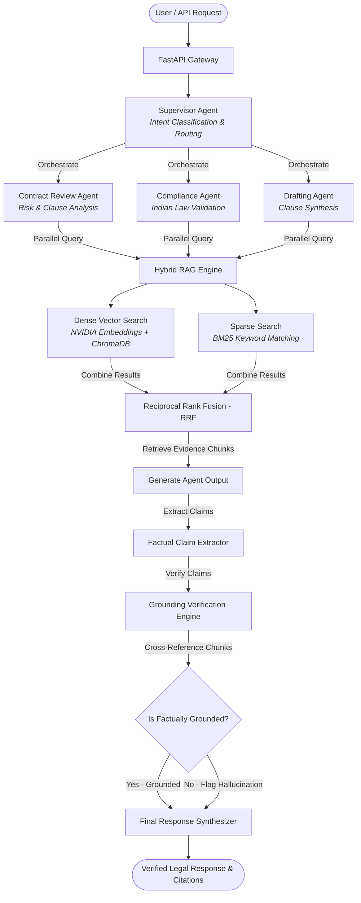

# ⚖️ LexAgent: Trustworthy Multi-Agent Legal & Compliance Intelligence

> **Verification-First Legal AI for Indian Enterprises powered by NVIDIA NIM, Nemotron-70B, and Hybrid RRF Retrieval.**

---

<p align="center">
  
  
  
  
  
</p>

---

## 🚨 The Challenge: Hallucinated Legal Claims

In high-stakes enterprise legal and compliance workflows, traditional LLMs suffer from a critical flaw: **plausible hallucinations**. A generative AI might draft an elegant contract clause or verify compliance, but cite non-existent statutory sections (e.g., *"Section 999 of the RBI Regulations"*).

These fake citations lead to:
* **Compliance Violations** & legal penalties.
* **Contractual Disputes** during execution.
* **Loss of Trust** in automation technologies.

**LexAgent solves this by reversing the paradigm. Instead of prioritizing text generation, LexAgent prioritizes factual grounding and citation verification.**

> 💡 **Core Principle: No Traceable Citation = No Response.**

---

## 🏗️ System Architecture

LexAgent utilizes a **Supervisor-Worker Multi-Agent Architecture** that divides complex legal requests into parallel, specialized tasks, enforces factual grounding, and synthesizes a verified report.



---

## 🌟 Key Features

* **Dual-Engine Hybrid Retrieval (RAG)**: Integrates semantic search (NVIDIA Embeddings + ChromaDB) with lexical keyword matching (BM25) fused via Reciprocal Rank Fusion (RRF) to retrieve legal clauses with pinpoint accuracy.
* **Factual Grounding Engine**: Runs an automated claim-extraction step on all specialist agent responses, verifying each claim's existence against the source contract text. Hallucinated claims are automatically rejected or flagged.
* **Indian Statutory Alignment**: Pre-configured agents specifically mapped to evaluate contracts against Indian statutes:
  * **Indian Contract Act, 1872** (Validity & restraint of trade checks)
  * **Companies Act, 2013** (Corporate authorization & governance compliance)
  * **Information Technology Act, 2000** (Data protection, privacy, & e-signature validity)
  * **SEBI Guidelines & RBI Circulars** (For financial and market-related clauses)
* **Supervisor-Worker Orchestration**: Autonomously parses user intent and splits requests into sub-tasks, running specialist agents in parallel using Python `asyncio` for low-latency responses.

---

## ⚡ Powered by NVIDIA NIM Stack

LexAgent is optimized to leverage NVIDIA's enterprise-grade GenAI inference software stack:

| Technology Layer | NVIDIA Product | Implementation / Benefit |
| :--- | :--- | :--- |
| **LLM Inference Gateway** | **NVIDIA NIM API** | Low-latency inference hosting optimized model weights. |
| **Cognitive Reasoning** | **Nemotron-70B-Instruct** | Deep reasoning model used for final response synthesis and claim verification. |
| **Intent & Quick Extraction** | **Llama-3.1-8B-Instruct** | Low-latency worker model used for fast sub-task intent classification. |
| **Dense Vector Embeddings** | **NVIDIA NV-Embed-QA-E5-V5** | High-performance embedding model optimized for retrieval-augmented generation. |
| **Acceleration (Planned)** | **RAPIDS cuVS** | GPU-accelerated vector index lookup to handle thousands of pages of contract text. |
| **Safety Shield (Planned)** | **NeMo Guardrails** | Configured rails to prevent jailbreaks, prompt injections, and off-topic requests. |

---

## 🔄 End-to-End Workflow Example

When a user submits: *"Review this NDA and check if it complies with Indian law."*

1. **Document Upload**: The PDF contract is uploaded, parsed page-by-page, and indexed.
2. **Intent Classification**: The Supervisor identifies the document and targets `contract_review` and `compliance` tasks.
3. **Evidence Retrieval**:
   * **Dense Search** matches concepts (e.g., "limitation of liability" matches "damages cap").
   * **Sparse Search** finds exact keyword references (e.g., "Section 27", "Arbitration").
   * **RRF** ranks and returns the top 5 most relevant legal segments.
4. **Specialist Evaluation**:
   * **Contract Reviewer** isolates risk clauses, assesses risk level, and generates a structured JSON review.
   * **Compliance Specialist** evaluates validity under the Indian Contract Act and flags anomalies.
5. **Grounding Verification**:
   * The agent output is evaluated to extract all factual assertions (e.g., *"This NDA restricts the vendor's trade for 3 years"*).
   * Each assertion is verified against retrieved contract chunks.
   * A confidence score is computed. Unverified assertions are listed under `hallucinated_claims`.
6. **Synthesis**: Results are combined into a clean, markdown-formatted professional legal summary with clear citations and risk flags.

---

## 🔌 API Endpoints

### 1. Upload & Index Contract
* **Endpoint**: `POST /upload`
* **Content-Type**: `multipart/form-data`
* **Response**:
```json
{
  "doc_id": "9a31e8c9-fa2b-42ab-9d8a-ee6465c1979b",
  "filename": "Vendor_Agreement.pdf",
  "chunks_indexed": 42
}
```

### 2. Multi-Agent Chat
* **Endpoint**: `POST /chat`
* **Payload**:
```json
{
  "message": "Verify the dispute resolution clauses and draft an amendment to move jurisdiction to Mumbai.",
  "session_id": "session_user_456",
  "doc_id": "9a31e8c9-fa2b-42ab-9d8a-ee6465c1979b"
}
```
* **Response**:
```json
{
  "response": "... Markdown synthesized response containing legal review, compliance analysis, and Mumbai jurisdiction amendment ...",
  "intent": {
    "intent": "compliance",
    "sub_tasks": ["compliance", "draft"],
    "requires_document": true
  },
  "agent_results": {
    "compliance": {
      "is_compliant": true,
      "issues": [],
      "summary": "The clause complies with Indian laws."
    },
    "draft": {
      "drafted_clause_type": "Dispute Resolution",
      "drafted_text": "This Agreement shall be governed by Indian law, and disputes shall be subject to the exclusive jurisdiction of the courts of Mumbai...",
      "key_terms_explained": ["Exclusive jurisdiction", "Mumbai courts"],
      "commercial_implications": "Limits litigation venue risks to Mumbai."
    }
  },
  "verification_passed": true
}
```

---

## 🚀 Getting Started

### Prerequisites
* Python 3.10+
* NVIDIA NIM API Key (or OpenAI API Key)

### Installation

1. **Clone the Repository**:
   ```bash
   git clone https://github.com/karthikj5453/LexAgent-.git
   cd LexAgent-
   ```

2. **Create a Virtual Environment**:
   ```bash
   python -m venv .venv
   ```

3. **Activate the Environment**:
   * **Windows**:
     ```powershell
     .\.venv\Scripts\activate
     ```
   * **Linux/macOS**:
     ```bash
     source .venv/bin/activate
     ```

4. **Install Dependencies**:
   ```bash
   pip install -r requirements.txt
   ```

5. **Configure Environment Variables**:
   Create a `.env` file in the root directory:
   ```env
   NIM_API_KEY=your_nvidia_api_key
   NIM_BASE_URL=https://integrate.api.nvidia.com/v1
   NIM_MODEL=nvidia/llama-3.1-nemotron-70b-instruct
   NIM_EMBEDDING_MODEL=nvidia/nv-embedqa-e5-v5
   ```

---

## 🖥️ Running the Application

### 1. Start the FastAPI Server
```bash
uvicorn api.main:app --reload --port 8000
```
Visit the interactive Swagger API documentation at: **[http://localhost:8000/docs](http://localhost:8000/docs)**.

### 2. Run the Test Suite
Ensure the current folder is on the `PYTHONPATH` and run pytest:
```bash
$env:PYTHONPATH="."
pytest
```

---

## 📈 Tracing & Trutworthiness Metrics

LexAgent uses standardized evaluation frameworks to prove its grounding capabilities:
* **Factual Grounding Score**: Calculated as the ratio of verified claims to total generated claims.
* **Trace Observability**: Integrates OpenInference tracing dashboard (compatible with Arize Phoenix) to inspect the execution flows, RAG chunks, and latency profiles of individual worker agents.
